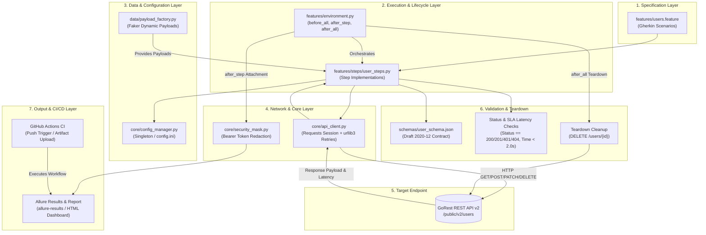

# GOReST API AUTOMATION FRAMEWORK

[](https://www.python.org/)
[](https://requests.readthedocs.io/)
[](https://behave.readthedocs.io/)
[](https://cucumber.io/docs/gherkin/)
[](https://json-schema.org/)
[](https://allurereport.org/)
[](https://github.com/features/actions)

A Python-based REST API automation framework for BDD-driven testing, contract validation, dynamic test data generation, reporting, and automated execution.

---

<a id="project-demo"></a>
## 🎥 Project Demo

Watch the project demonstration covering framework setup, API execution, BDD scenarios, validation, reporting, and the overall automation workflow.

[▶️ Watch the Full Project Demo](https://drive.google.com/file/d/1514yLksAXAjsQ_R9jSgwG5VS1iAPGYFb/view?usp=drivesdk)

The demonstration showcases the framework setup, BDD workflow, API execution, validation, reporting, and automation flow:
[▶️ Watch the Full Project Demonstration](https://drive.google.com/file/d/1514yLksAXAjsQ_R9jSgwG5VS1iAPGYFb/view?usp=drivesdk)

---

<a id="table-of-contents"></a>
## 📑 Table of Contents

- [🎥 Project Demo](#project-demo)
- [🚀 Overview](#overview)
- [✨ Key Features](#key-features)
- [🛠️ Technology Stack](#technology-stack)
- [🏗️ Architecture](#architecture)
- [📁 Project Structure](#project-structure)
- [🔌 API Coverage](#api-coverage)
- [🧪 Test Strategy](#test-strategy)
- [⚙️ Installation](#installation)
- [🔐 Configuration](#configuration)
- [▶️ Running Tests](#running-tests)
- [📊 Allure Reporting](#allure-reporting)
- [🔄 CI/CD](#cicd)
- [🔒 Security Practices](#security-practices)
- [🔮 Future Improvements](#future-improvements)
- [👨‍💻 Author](#author)

---

<a id="overview"></a>
## 🚀 Overview

**GOReST API AUTOMATION FRAMEWORK** is a modular, maintainable automated testing solution built to validate the [GoRest v2 RESTful API](https://gorest.co.in/public/v2) (`/users` resource). It provides software engineering teams and QA practitioners with a robust test architecture capable of executing positive, negative, and contract-level assertions across RESTful endpoints.

Testing modern REST APIs demands more than basic status-code checking. This framework addresses critical production testing challenges: race conditions from duplicated test data, leaked authentication secrets in CI logs, flaky tests caused by transient network throttles, schema drift across releases, and orphaned test records polluting remote datastores.

The framework organizes API automation using **Behavior-Driven Development (BDD)** via Behave and Gherkin. Business-readable feature specifications map directly to modular step definitions powered by a resilient HTTP client. Responses undergo multi-tier validation, including status code checks, payload value assertions, strict Draft 2020-12 JSON Schema contract compliance, and microsecond-level SLA latency benchmarks.

Test data is synthesized dynamically using the Factory Pattern and Faker to ensure isolated, collision-free executions. Diagnostic evidence with automated Bearer-token masking is attached to every execution step, generating detailed Allure visual dashboards. The complete lifecycle is automated for continuous testing via GitHub Actions.

---

<a id="key-features"></a>
## ✨ Key Features

- **BDD-Driven API Testing**: Human-readable Gherkin feature files (`features/users.feature`) paired with reusable, parameterized Python step definitions.
- **Complete CRUD Lifecycle Coverage**: Automated testing of Create (`POST`), Read (`GET`), Update (`PATCH`), and Teardown (`DELETE`) operations on the `/users` endpoint.
- **Strict JSON Schema Contract Validation**: Validates API response structures against Draft 2020-12 specifications, enforcing types, email formats, enum constraints (`gender`, `status`), and rejecting schema pollution via `additionalProperties: false`.
- **Dynamic Synthetic Test Data**: Uses Faker within `UserPayloadFactory` to generate unique emails (`cls._faker.unique.email()`) and random profile attributes on every test iteration.
- **Resilient HTTP Engine with Automatic Retries**: Wraps `requests.Session` with `urllib3.util.retry.Retry` to gracefully handle transient network drops and rate limits (`429`, `500`, `502`, `503`, `504`) using exponential backoff across all REST methods.
- **Automated Credential Masking**: Intercepts diagnostic HTTP headers and payloads using regex filtering (`core/security_mask.py`) to redact sensitive `Bearer <token>` strings to `Bearer [REDACTED_TOKEN]` before serialization into logs and Allure attachments.
- **SLA & Performance Benchmarking**: Validates response latency on every critical endpoint against strict thresholds (`elapsed.total_seconds() < 2.0s`) to catch performance regressions early.
- **Zero-Footprint Lifecycle Teardown**: Automatically records newly created IDs during execution and deletes all test records via an `after_all` hook, preventing ghost records in remote environments.
- **Multi-Environment Configuration**: Thread-safe Singleton configuration loader (`core/config_manager.py`) supporting environment switching (`local`, `staging`, `prod`) driven by `API_ENV`.
- **Interactive Allure Reporting**: Produces rich visual HTML dashboards with step-by-step execution trees, timing graphs, attachments, and failure analyses.
- **Live WebSocket Dashboard**: Includes an optional real-time browser execution tracker (`run_live_execution.ps1`) displaying live test events, latency metrics, and assertions as they execute.
- **Automated CI/CD Integration**: Seamless GitHub Actions workflow (`.github/workflows/api-tests.yml`) executing tests on every code push and publishing test artifacts.

---

<a id="technology-stack"></a>
## 🛠️ Technology Stack

| Category | Technology | Version / Standard | Role in Framework |
| :--- | :--- | :--- | :--- |
| **Language** | Python | 3.10+ | Core framework execution and automation logic |
| **HTTP Engine** | Requests | >= 2.31.0 | REST communication, connection pooling, and session management |
| **Retry Strategy** | urllib3 (Retry) | Bundled with Requests | Exponential backoff for HTTP 429 and 5xx transient statuses |
| **BDD Framework** | Behave | >= 1.2.6 | Gherkin scenario parser, step dispatch, and hook management |
| **Specification** | Gherkin | Business-readable syntax | Declarative feature and scenario definition (`Given`, `When`, `Then`) |
| **Target API** | GoRest RESTful API | v2 (`/public/v2`) | Public REST API service under test |
| **Contract Validation** | jsonschema | >= 4.21.0 | Draft 2020-12 JSON Schema specification compliance |
| **Test Data** | Faker | >= 24.0.0 | Synthetic, unique, collision-free test payload generation |
| **Reporting** | Allure Framework | >= 2.30.0 (allure-behave) | Test execution visualization, metric collection, and diagnostics |
| **CI/CD** | GitHub Actions | Ubuntu Latest | Continuous integration build, test execution, and artifact archiving |
| **Automation** | PowerShell | 5.1+ / 7+ | Automated local Allure CLI installation and runner scripts |
| **Configuration** | configparser / os | INI & Environment Vars | Multi-environment target switching and decoupled token management |

---

<a id="architecture"></a>
## 🏗️ Architecture

The framework is structured in decoupled, cohesive layers to separate business specifications, execution logic, network communication, validation, and reporting.



### Architectural Responsibilities

1. **Specification Layer (`features/`)**: Houses declarative Gherkin feature definitions detailing user creation, retrieval, updates, SLA constraints, and negative authentication flows.
2. **Execution & Lifecycle Layer (`features/steps/`, `features/environment.py`)**: Maps Gherkin phrases to test operations, manages execution hooks, attaches step-level evidence to Allure, and coordinates teardown cleanup.
3. **Data & Configuration Layer (`data/`, `core/config_manager.py`)**: Uses Faker to generate unique, isolated test fixtures and provides a thread-safe singleton to load target endpoints and authentication tokens.
4. **Network & Core Layer (`core/api_client.py`, `core/security_mask.py`)**: Manages the HTTP session, connection pooling, and exponential backoff retry policies while redacting sensitive tokens from all diagnostic evidence.
5. **Validation Layer (`schemas/`, assertions)**: Evaluates structural conformity against Draft 2020-12 schema rules, checks HTTP status codes, and enforces SLA response-time requirements.
6. **Reporting & CI/CD Layer (`reporting/`, `.github/workflows/`)**: Serializes sanitized test evidence into Allure JSON format, builds HTML execution dashboards, and runs automated verification in GitHub Actions.

---

<a id="project-structure"></a>
## 📁 Project Structure

```plaintext
GOReST-API-AUTOMATION-FRAMEWORK/
│
├── .gitignore                                   # Git ignore rules for virtual environments and artifacts
├── install_allure.ps1                           # Automated Allure CLI installer script (Maven Central)
├── run_and_serve.ps1                            # Unified test execution and Allure dashboard server
├── run_live_execution.ps1                       # Real-time WebSocket execution dashboard launcher
├── README.md                                    # Project documentation
│
├── api_framework/                               # Main framework source directory
│   ├── requirements.txt                         # Pinned Python package dependencies
│   │
│   ├── .github/
│   │   └── workflows/
│   │       └── api-tests.yml                    # GitHub Actions CI workflow definition
│   │
│   ├── config/
│   │   ├── __init__.py                          # Package initializer
│   │   └── config.ini                           # Multi-environment endpoints (local, staging, prod)
│   │
│   ├── core/
│   │   ├── __init__.py                          # Package initializer
│   │   ├── api_client.py                        # Resilient HTTP Client with retry adapters & pooling
│   │   ├── config_manager.py                    # Thread-safe Singleton configuration loader
│   │   ├── execution_state.py                   # State tracker for live execution dashboard
│   │   └── security_mask.py                     # Regex-based Bearer token redactor for evidence
│   │
│   ├── data/
│   │   ├── __init__.py                          # Package initializer
│   │   └── payload_factory.py                   # Dynamic synthetic payload generator (Faker)
│   │
│   ├── features/
│   │   ├── environment.py                       # Lifecycle hooks (before_all, after_step, after_all)
│   │   ├── users.feature                        # Gherkin BDD Feature specifications
│   │   └── steps/
│   │       ├── __init__.py                      # Package initializer
│   │       └── user_steps.py                    # Reusable Step Definitions (@step, @when, etc.)
│   │
│   ├── schemas/
│   │   └── user_schema.json                     # JSON Schema (Draft 2020-12) contract specification
│   │
│   ├── reporting/
│   │   ├── allure-student-theme.css             # Presentation styling for Allure HTML dashboard
│   │   ├── generate_allure_report.ps1           # Script to compile and serve Allure HTML report
│   │   ├── live_execution.html                  # Real-time execution dashboard web interface
│   │   └── live_execution_server.py             # HTTP/WebSocket server streaming execution status
│   │
│   └── allure-results/                          # Generated Allure JSON execution evidence (git-ignored)
│
└── Screenshots/                                 # Architectural diagrams & execution evidence
    ├── fig_4_1_system_architecture.png          # Framework system architecture diagram
    ├── fig_4_2_bdd_execution_workflow.png       # BDD execution flow diagram
    ├── fig_4_3_live_dashboard_pipeline.png      # Live execution dashboard architecture
    ├── fig_5_1_live_dashboard_overview.png      # Real-time dashboard interface screenshot
    ├── fig_5_2_live_dashboard_event_stream.png  # Real-time event log stream screenshot
    ├── fig_5_3_allure_dashboard_overview.png    # Allure report overview dashboard
    ├── fig_5_4_allure_behaviors_tree.png        # Allure BDD behaviors tree view
    ├── fig_5_5_allure_redacted_evidence.png     # Allure request/response evidence with token masked
    ├── fig_5_6_allure_suites_breakdown.png      # Allure test suites breakdown
    └── fig_5_7_sla_assertion_breach.png        # SLA latency assertion demonstration
```

---

<a id="api-coverage"></a>
## 🔌 API Coverage

The framework verifies the `/public/v2/users` endpoint across the complete REST lifecycle:

| Operation | HTTP Method | Endpoint | Authentication | Verification Criteria |
| :--- | :---: | :--- | :---: | :--- |
| **Create User** | `POST` | `/public/v2/users` | Required | Status `201 Created`, user ID assigned, schema contract matches, latency < 2.0s |
| **Retrieve User** | `GET` | `/public/v2/users/{id}` | Required | Status `200 OK`, response body matches created ID, schema contract matches |
| **Update User** | `PATCH` | `/public/v2/users/{id}` | Required | Status `200 OK`, updated attributes (`name`, `status`) persist, schema contract matches |
| **Delete User** | `DELETE` | `/public/v2/users/{id}` | Required | Automatic teardown in `after_all` hook; removes test record to prevent ghost data |
| **Unauthorized Create** | `POST` | `/public/v2/users` | None | Status `401 Unauthorized`; validates authentication rejection without token |
| **Non-Existent User** | `GET` | `/public/v2/users/999999999` | None | Status `404 Not Found`; validates resource missing error handling |

---

<a id="test-strategy"></a>
## 🧪 Test Strategy

The testing strategy is designed around defense-in-depth API verification:

- **Positive Functional Scenarios**: Validates the end-to-end user lifecycle (create, fetch, update) with business-relevant data.
- **Negative Authentication & Boundary Scenarios**: Verifies that unauthenticated requests receive `401 Unauthorized` and lookups for missing records return `404 Not Found`.
- **Contract & Schema Validation**: Uses Draft 2020-12 JSON Schema validation (`schemas/user_schema.json`) with `FormatChecker` and `additionalProperties: false`. Every payload is checked for expected field types, mandatory properties (`id`, `name`, `email`, `gender`, `status`), valid email format, and strict enum values.
- **Test Data Independence**: Avoids hardcoded static IDs or emails. `UserPayloadFactory` leverages `Faker` to generate unique emails (`unique.email()`) and random names per scenario, eliminating race conditions and state collisions.
- **SLA Performance Benchmarking**: Validates response latency (`elapsed.total_seconds() < 2.0s`) on all core requests, capturing microsecond timings to detect API degradation.
- **Resilience Against Flakiness**: The HTTP adapter retries transient HTTP errors (`429`, `500`, `502`, `503`, `504`) with an exponential backoff factor of 1 across 3 attempts, minimizing false negatives from network or rate-limiting spikes.
- **Zero-Footprint Cleanup**: Every user created during the test run has its ID appended to `context.created_users`. The `after_all` hook issues a `DELETE /users/{id}` request for every recorded ID, leaving the remote database in a clean state.

---

<a id="installation"></a>
## ⚙️ Installation

### Prerequisites

Ensure the following prerequisites are installed on your workstation:

- **Python 3.10+**: [python.org](https://www.python.org/)
- **Git**: [git-scm.com](https://git-scm.com/)
- **Java 8+ (JRE/JDK)**: Required only for compiling and serving local Allure HTML reports (e.g., [Eclipse Temurin](https://adoptium.net/))
- **GoRest API Token**: Free personal access token obtained from [GoRest Access Tokens](https://gorest.co.in/my-account/access-tokens)

### Setup Steps

1. **Clone the repository**:
   ```bash
   git clone https://github.com/anirban-005/Wipro-Capstone-Project.git
   cd Wipro-Capstone-Project
   ```

2. **Create and activate a virtual environment**:
   ```bash
   # Windows (PowerShell)
   python -m venv .venv
   .\.venv\Scripts\Activate.ps1

   # Linux / macOS
   python3 -m venv .venv
   source .venv/bin/activate
   ```

3. **Install dependencies**:
   ```bash
   pip install -r api_framework/requirements.txt
   ```

---

<a id="configuration"></a>
## 🔐 Configuration

The framework utilizes environment variables for sensitive authentication data and multi-environment targeting.

### Setting the API Token

#### Windows (PowerShell)
```powershell
$env:GOREST_TOKEN = "your_actual_gorest_api_token_here"
```

#### Linux / macOS (Bash)
```bash
export GOREST_TOKEN="your_actual_gorest_api_token_here"
```

### Environment Profiles (Optional)

Configure target environments through `api_framework/config/config.ini`:

```ini
[local]
base_url = https://gorest.co.in/public/v2

[staging]
base_url = https://gorest.co.in/public/v2

[prod]
base_url = https://gorest.co.in/public/v2
```

Switch target environments by setting the `API_ENV` variable (defaults to `staging`):

```powershell
# PowerShell
$env:API_ENV = "staging"

# Bash
export API_ENV="staging"
```

> [!IMPORTANT]
> Never commit API tokens, passwords, or secrets to version control. The framework reads credentials exclusively from the `GOREST_TOKEN` environment variable.

---

<a id="running-tests"></a>
## ▶️ Running Tests

### Option 1: Automated Execution & Allure Report Server (Recommended)

From the project root directory, run the provided automation script:

```powershell
# 1. Install local portable Allure CLI (one-time setup)
.\install_allure.ps1

# 2. Set your GoRest authentication token
$env:GOREST_TOKEN = "your_actual_gorest_api_token_here"

# 3. Execute the Behave test suite and auto-serve the Allure dashboard
.\run_and_serve.ps1
```

### Option 2: Live Execution Dashboard Mode

To monitor test progress in real-time via an interactive web interface:

```powershell
$env:GOREST_TOKEN = "your_actual_gorest_api_token_here"
.\run_live_execution.ps1
```

This launches a local web server (`http://127.0.0.1:8765`) displaying real-time WebSocket state transitions, response latencies, and active step assertions.

### Option 3: Manual Command-Line Execution

From the `api_framework` directory:

```bash
cd api_framework

# Execute Behave test suite with Allure formatter
behave -f allure_behave.formatter:AllureFormatter -o allure-results features/
```

To run a specific scenario or tag:
```bash
# Run authenticated scenarios only
behave --tags=@requires_auth -f allure_behave.formatter:AllureFormatter -o allure-results features/

# Run unauthenticated scenarios
behave --tags=~@requires_auth features/
```

---

<a id="allure-reporting"></a>
## 📊 Allure Reporting

Test execution automatically outputs diagnostic results to the `allure-results/` directory.

### Generating and Serving the Report Locally

Using the local portable Allure CLI installed via `.\install_allure.ps1`:

```powershell
# From the project root
.\.tools\allure\bin\allure.bat serve api_framework\allure-results

# Or from within api_framework/
..\.tools\allure\bin\allure.bat serve allure-results
```

If Allure is installed in your system PATH:

```bash
allure serve api_framework/allure-results
```

### Report Evidence Included

- **BDD Hierarchy**: Scenarios grouped by feature, behavior, and status.
- **Request / Response Diagnostic Attachments**: Exact HTTP method, URL, headers, and payload attached to each step.
- **Sanitized Credentials**: `Bearer <token>` headers are automatically redacted in all attached evidence.
- **Latency & Timings**: Detailed execution duration breakdown for individual steps and scenarios.

---

<a id="cicd"></a>
## 🔄 CI/CD

Continuous integration is managed through GitHub Actions (`.github/workflows/api-tests.yml`).

```yaml
name: API Tests

on:
  push:

jobs:
  behave:
    runs-on: ubuntu-latest
    env:
      GOREST_TOKEN: dummy-gorest-token
    steps:
      - uses: actions/checkout@v4
      - uses: actions/setup-python@v5
        with:
          python-version: "3.10"
      - name: Install dependencies
        run: pip install -r api_framework/requirements.txt
      - name: Run Behave API tests
        working-directory: api_framework
        run: behave -f allure_behave.formatter:AllureFormatter -o allure-results features/
      - name: Upload Allure results
        uses: actions/upload-artifact@v4
        if: always()
        with:
          name: allure-results
          path: api_framework/allure-results
```

### Pipeline Workflow

1. **Trigger**: Executes on every code `push` to the repository.
2. **Environment**: Provisions an `ubuntu-latest` runner with Python 3.10.
3. **Dependency Resolution**: Installs pinned dependencies from `api_framework/requirements.txt`.
4. **Test Execution**: Executes the Behave test suite and generates Allure JSON results. Scenarios requiring authentication gracefully handle token conditions.
5. **Artifact Publishing**: Archives `api_framework/allure-results` using `actions/upload-artifact@v4` with `if: always()`, preserving diagnostic evidence regardless of test outcome.

---

<a id="security-practices"></a>
## 🔒 Security Practices

- **Zero Hardcoded Secrets**: All authentication tokens are read dynamically at runtime via the `GOREST_TOKEN` environment variable. No API keys or tokens are stored in configuration files or committed to Git.
- **Automated Evidence Redaction**: The `mask_sensitive_data()` function in `core/security_mask.py` applies regex filters (`r"Bearer\s+[a-zA-Z0-9\-_\.]+"`) to replace authentication headers with `Bearer [REDACTED_TOKEN]` across all logs and Allure report attachments.
- **Decoupled Environment Configurations**: Endpoint definitions in `config.ini` contain only public base URLs, separating configuration targets from credentials.
- **Automatic Resource Cleanup**: Guarantees test records are removed via `DELETE /users/{id}` in the `after_all` lifecycle hook, avoiding data pollution.
- **Strict Payload Validation**: JSON Schema contracts with `additionalProperties: false` prevent unrecognized or unauthorized attributes from being accepted during response parsing.

---

<a id="future-improvements"></a>
## 🔮 Future Improvements

- **Broader Endpoint Coverage**: Extend BDD feature files to cover additional GoRest resources (`/posts`, `/comments`, `/todos`).
- **Parallel Test Execution**: Integrate multi-threaded or multi-process Behave runners to accelerate execution for larger test suites.
- **Containerized Test Runner**: Provide a `Dockerfile` and `docker-compose.yml` for isolated container execution across developer environments.
- **Automated GitHub Pages Publishing**: Add an Allure report generation step in the CI pipeline to publish HTML dashboards directly to GitHub Pages.
- **Data-Driven Scenario Outlines**: Expand scenario outlines for boundary data variations (e.g., maximum string lengths, special characters, unicode strings).

---

<a id="author"></a>
## 👨‍💻 Author

**Anirban Bhattacharya**  
GitHub: [@anirban-005](https://github.com/anirban-005)  
Repository: [Wipro-Capstone-Project](https://github.com/anirban-005/Wipro-Capstone-Project)
